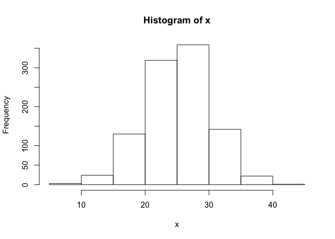
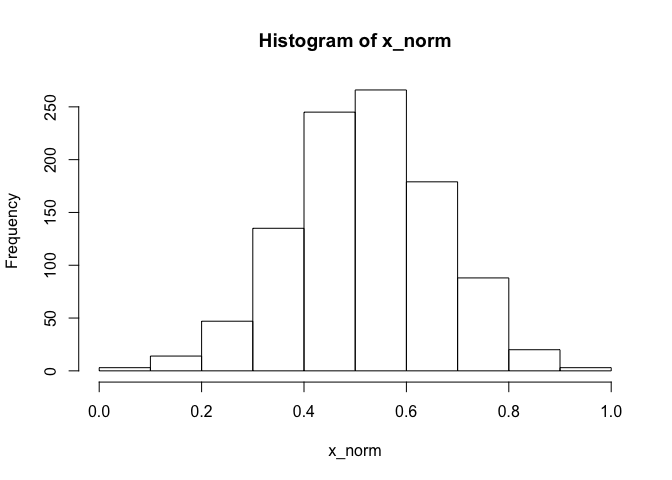
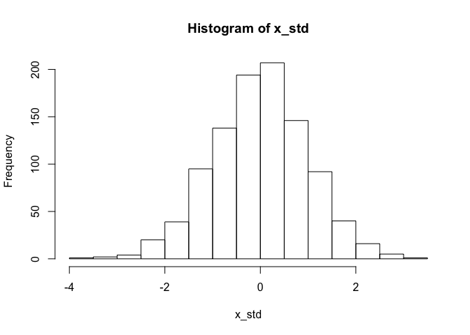

<!-- README.md is generated from README.Rmd. Please edit that file -->
numvert
=======

The goal of numvert is to help transform numeric vectors. All numvert functions:

-   Take a numeric vector as the first argument
-   Return a numeric vector of the same length as input
-   Start with `num_`

Installation
------------

You can install numvert from github with:

``` r
# install.packages("devtools")
devtools::install_github("drsimonj/numvert")
```

Example
-------

This example shows you how to conduct common rescaling operations with numvert:

``` r
# Create a normally distributed variable with a mean of 25 and SD of 5
x <- rnorm(1000, mean = 25, sd = 5)
hist(x)
```



Use numvert to standardise or normalise it:

``` r
library(numvert)
```

``` r
# Normalise between 0 and 1
x_norm <- num_norm(x)
hist(x_norm)
```



``` r
# Standardise to have mean of 0 and SD of 1
x_std <- num_std(x)
hist(x_std)
```


